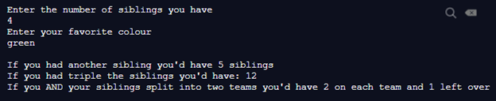

# 1-5 Exercise 2

### The assignment
Edit the file named "student.py".  
Write a Python program that takes in a user’s favorite colour, and the number of siblings they have. Display the following:    

#### Note 
You need to input both the number of siblings and favorite colour for the automated grading to work.

## Check your work
Select the "Actions" tab on GitHub and select your latest commit. This will show you if your exercise passes all test cases.
